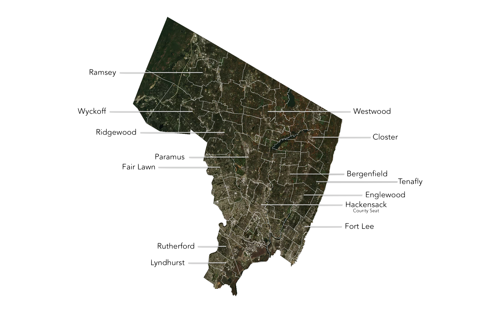

# The County of Bergen

---

### Boundaries

Bergen County occupies New Jersey's northeastern edge, where suburban New Jersey meets the New York metropolitan machine. New York State sits on its northern and eastern sides, with the Hudson marking a hard eastern border. To the west and south lie Passaic and Essex, forming a softer internal frontier shaped less by law than by commuter flows.

---

### Water

Water is both infrastructure and constraint. The Hackensack and Passaic river systems cut through the county, while Oradell Reservoir, Woodcliff Lake and Lake Tappan underpin regional water supply. What looks like landscape is, in practice, a managed utility network.

---

### Mountains & Cliffs

Topography sharpens toward the margins. The Ramapo Mountains rise in the north-west, and the Palisades form a dramatic basalt wall above the Hudson. The result is a county that is geographically varied but economically integrated, with sightlines that quite literally point to Manhattan.

---

### Transportation

Transport is Bergen's governing logic. I-80, I-95, Route 4 and Route 17 carry a daily circulation of workers and goods, reinforced by NJ Transit lines into Hoboken and New York City. Bridges and tunnels tie the county to Manhattan and the Bronx, turning geography into a timetable.

---

### Towns

Hackensack is the county seat, but Bergen's character is distributed across a patchwork of municipalities. Englewood, Ridgewood, Teaneck and Fort Lee each play distinct roles, yet all belong to the same metropolitan ecology: locally governed, regionally dependent, and closely coupled to New York's economy.

---
