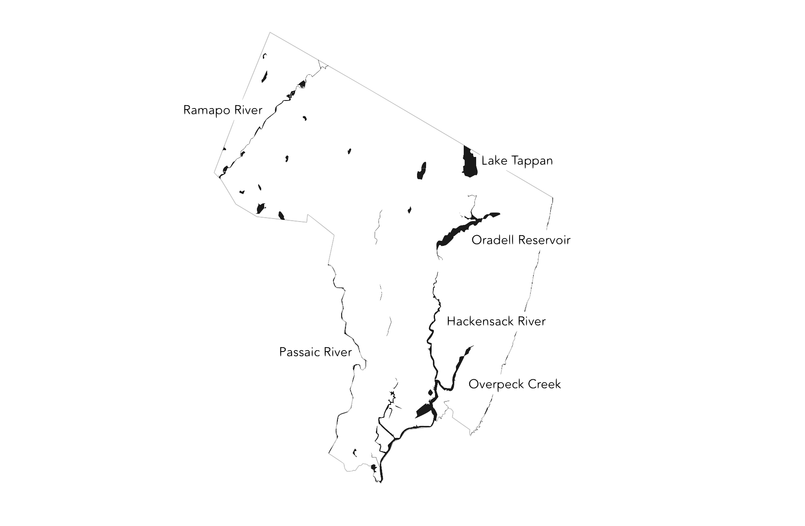

# The County of Bergen

---

### Boundaries

Bergen County sits in the northeastern corner of New Jersey, bordered by New York to the north and east. The Hudson River forms its eastern edge, while Passaic and Essex counties border to the west and south.

---

### Water

The Hackensack and Passaic Rivers flow through Bergen, with reservoirs like Oradell, Woodcliff Lake, and Lake Tappan supplying water and shaping the landscape.

---

### Mountains & Cliffs

The Ramapo Mountains rise in the northwest, while the Palisades form sheer basalt cliffs along the Hudson River, offering dramatic views into Manhattan.

---

### Transportation

Bergen is crisscrossed by I-80, I-95, Route 4, and Route 17, along with NJ Transit commuter lines to Hoboken and NYC. Bridges and tunnels link the county to Manhattan and the Bronx.

---

### Towns

Hackensack serves as the county seat. Other notable municipalities include Englewood, Ridgewood, Teaneck, Fort Lee, and Fair Lawn — each with its own character and local history.

---