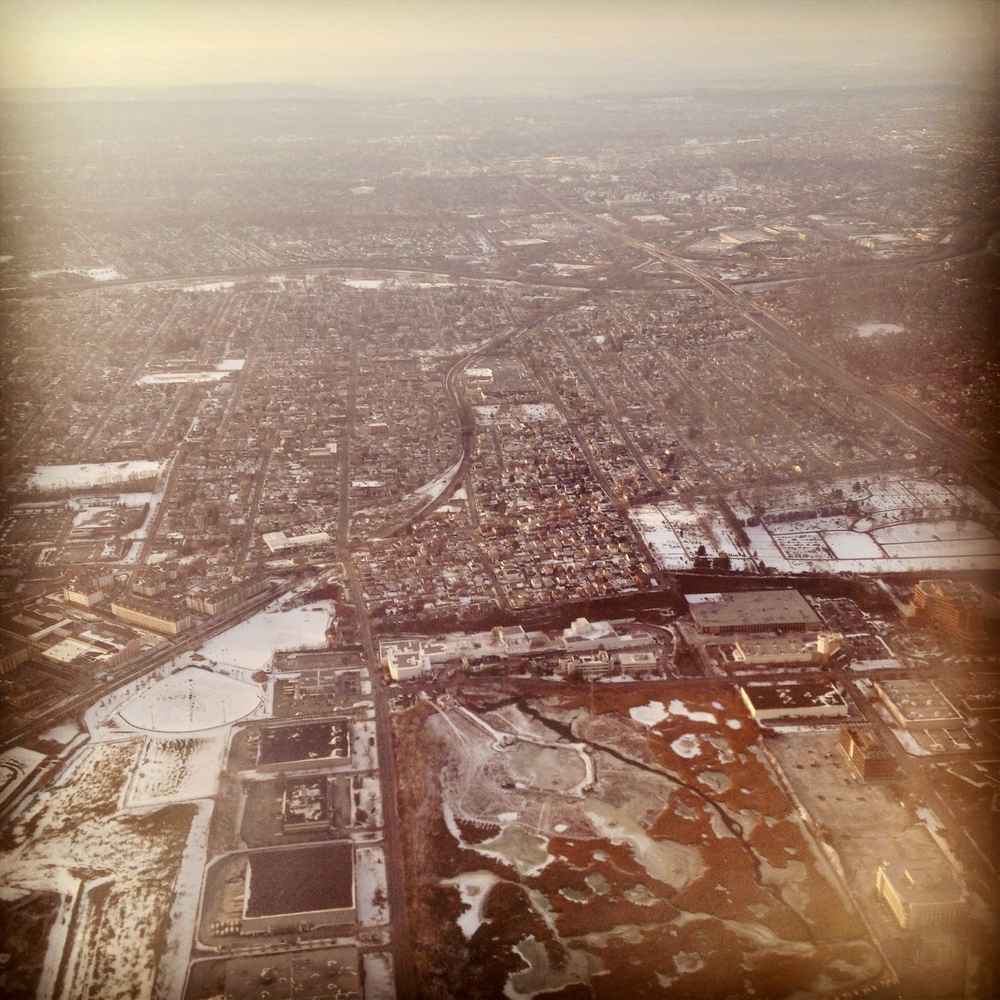

# Kingsland

---

## Timeline  

| **Year / Era** | **Event** |
|-----------------|------------|
| **Pre-1700s** | Lenape hunting and fishing grounds along the Hackensack flats.[1] |
| **1720s–1730s** | Isaac Kingsland acquires and drains portions of the Hackensack salt meadows for hay production — early “meadow lots.”[1] |
| **1840s–1860s** | Area used for Dutch-English pasture and small clay pits within New Barbadoes Township.[2] |
| **1868–1870** | Delaware, Lackawanna & Western Railroad extends its main line through the meadows; **Kingsland Station** established.[4] |
| **1880s–1890s** | Growth of **Kingsland Brick Works** and DL&W rail-servicing shops; a small hamlet forms around the station, populated largely by Italian immigrant laborers.[2][4][5] |
| **1916–1917** | **Canadian Car & Foundry** builds munitions plant for Allied contracts, employing hundreds of local and immigrant workers; destroyed in the **Kingsland Explosion** (Jan 11 1917).[3] |
| **1920s–1940s** | Site redeveloped for **light manufacturing and warehouses**; residential blocks expand inland as Lyndhurst suburbanizes.[3][4][6] |
| **Post-1950** | Becomes a **commuter suburb**; the rail corridor remains active while industry declines.[4][6] |
| **Today** | Low, level housing and industrial remnants — a suburb built over reclaimed marsh and rail fill, shaped as much by labor as by land.[4][6] |

---

### Notes

[1] *Geological Survey of New Jersey, Final Report of the State Geologist*, vol. IV (Trenton: MacCrellish & Quigley, 1882), 317.  
[2] *New Jersey State Agricultural Society, Transactions for 1893* (Trenton: The Society, 1894), 88–89.  
[3] “Kingsland Explosion Wrecks Shell Plant,” *New York Times*, January 12, 1917; *Industrial Directory of New Jersey*, 1927 (Trenton: State of N.J., 1928), 241.  
[4] *Delaware, Lackawanna & Western Railroad Co., Time Table and Guide*, Summer 1936; *Bergen County Planning Board, Rail Commuter Study*, 1949.  
[5] *U.S. Census of Population and Housing, Bergen County Enumeration Districts, 1900–1930*; *St. Michael’s Parish Records*, Lyndhurst Historical Society Collection.  
[6] Bergen County Historical Society, *Lyndhurst: A Brief History of the Meadowlands Towns* (Hackensack, 1981), 42–47.  

---

