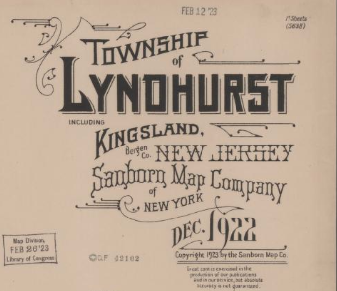

# Kingsland

---

| **Section**                | **Description**                                                                                                                                                                                                                                                                      |
|----------------------------|--------------------------------------------------------------------------------------------------------------------------------------------------------------------------------------------------------------------------------------------------------------------------------------|
| **Location**               | Situated on the western edge of the Hackensack Meadowlands in southern Bergen County, New Jersey, some eight miles from New York City; wedged between salt-meadow and upland ridge.                                                                                                   |
| **Soil & Situation**       | Meadow-muck and clay underlain by marl (once worked for brick-earth), turning to firmer loam and gravel inland. Formerly timbered with oak and hickory, though now largely cleared. Damp airs and fogs drift up from the Meadowlands.                                             |
| **Industry & Improvement** | From Lenape hunting-ground to Dutch clay pits and pasture; then brickworks and DL&W rail-shops; briefly a munitions hub (Canadian Car & Foundry, 1917); later toy, barbell, and light manufacturing; now chiefly warehousing and freight.                                           |
| **Present Condition**      | A commuter quarter of modest brick and clapboard houses centred on NJ Transit’s Kingsland station. Industry has ebbed, but the place retains a plain, workmanlike aspect.                                                                                                            |
| **Population & Character** | Long a no-nonsense railroad village of Italian-American families, Kingsland has settled into a commuter backwater: mortgage-holding, quietly aspirational, and disinclined to make a fuss.                                                                                          |

---

### Sources

<small>

[1] NJSEA. “History of the Meadowlands: Industry and Ecology.”  
[2] *Wikipedia*: Kingsland, New Jersey — History and Industrial Development.  
[3] *Wikipedia*: Kingsland Explosion (1917).  
[4] *Wikipedia*: Lyndhurst, New Jersey — Economic History.  

</small>
