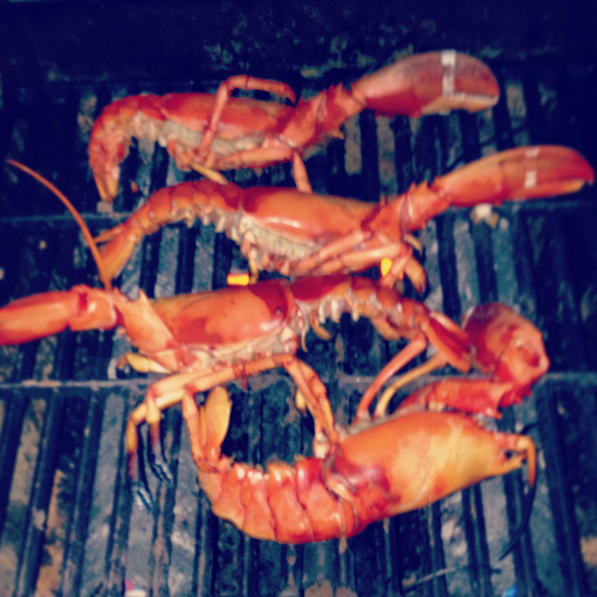

# Grilled Lobster

There’s nothing delicate about a lobster. It wears armor, cracks clams for a living, and survives under crushing tides. The only proper way to eat one is quickly and over fire - not drowned in butter or fuss.

---

## Ingredients

- 2 live lobsters (1½–2 lb hard-shells)  
- Olive oil  
- Sea salt  
- 1 lemon  

---

## Method

1. Place each lobster on its back. Drive a sharp knife between the eyes and split clean through. No slow boiling — end it quickly.

2. Brush the exposed meat with olive oil. Not for flavor — just so it doesn’t weld itself to the grill.

3. Lay on a medium-hot fire **cut-side down** for 2–3 minutes. Flip to **shell-side down** and cook until the shell turns deep red and white foam seeps from the tail — 8–10 minutes for smaller lobsters, 12–14 for larger.

4. Remove, sprinkle with sea salt, and give each half a hard squeeze of lemon.

---

## Field Note

Lobsters have survived ice ages, wooden traps, and worse. Treat them with respect — don’t overcook them, don’t smother them, and eat them with your hands.
